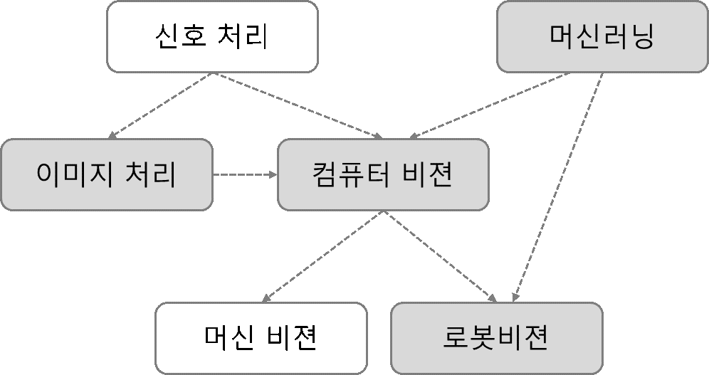

# chapter00 : 3D 영상처리

우리의 오감 중에서 가장 중요한 요소를 뽑으라면 대부분의 사람들은 눈을 선택할 것입니다. 그만큼 세상을 인지하는 데 있어 시각 즉, 영상은 많은 정보를 포함하고 있습니다. 영상정보에서 의미 있는 정보를 추출하는 연구는 오래 전부터 이뤄져 왔습니다. 이는 보통 영상신호처리, 이미지처리, 컴퓨터 비전, 로봇비전, 패턴인식 등의 연구 분야에서 진행돼 왔습니다. \[그림 1.1\]은 영상처리와 관련된 연구 분야를 도표화한 것입니다.



본문에서 다루고자 하는 3D 영상처리는 최종적으로 로봇 비전과 연관이 있으며 하드웨어인 카메라나 거리센서의 이미지/신호처리 처리를 통해 영상을 획득하고 패턴인식 등의 머신러닝 알고리즘을 이용해 공간과 사물을 인식하는 것을 목표로 하고 있습니다. \[그림 1.1\]에서 회색으로 표시된 부분 입니다. 각 용어들에 대한 자세한 설명은 아래와 같습니다\(Alex Owen-Hill, 2016\). 

**신호 처리\(Signal Processing\):** 신호처리란 신호에서 잡음을 제거하거나 정보를 추출해 이후 후속작업에서 활용할 수 있게 다듬는 작업을 의미합니다. 신호는 아날로그\(Analog electrical signals\) 또는 디지털 신호\(Digital electronic signals\) 로 표현되며, 음향, 전자기파, 영상 또는 센서 출력 값 등 다양한 측정값을 표현할 수 있습니다. 본문에서는 영상 또는 센서 출력 값을 주로 다루고 있습니다. 

**이미지 처리\(Image Processing\) vs 컴퓨터 비전\(Computer Vision\):** 컴퓨터 비전과 이미지 처리는 같은 레벨이지만 목적은 다릅니다. 이미지 처리 기술은 주로 이미지 질을 향상시키거나 포맷\(e.g. 히스토그램\)을 변경해 이후 작업에 활용하는데 목적을 두고 있습니다. 반면, 컴퓨터 비전은 이미지에서 정보를 추출해 이해하는데 목적을 두고 있습니다. 즉, 이미지 처리를 통해서 컬러 이미지를 흑백으로 변경하고 컴퓨터 비전을 통해서 이미지상 물체를 탐지할 수 있습니다. 

**패턴인식\(Pattern Recognition\) and 머신러닝\(Machine Learning\):** 패턴인식 또는 머신러닝은 데이터에서 특정한 패턴을 탐지하는데 목적을 두고 있습니다. 데이터는 엑셀파일과 같은 정형데이터 일수도 있고, 이미지나 센서와 같은 비정형 데이터 일수도 있습니다. 따라서 컴퓨터 비전에 국한되지 않는 상위 계층 분야에 속합니다. 그러나 모든 컴퓨터 비전분야에서 머신러닝을 필요로 하지는 않으며 이미지나 센서 신호가 아닌 데이터에서도 머신러닝을 사용할 수 있습니다. 

**머신 비전\(Machine Vision\):** 지금까지 살펴본 것들이 과학적 영역\(Scientific domains\)이라면 머신비전은 공학적 영역\(Engineering domain\)에 속합니다. 머신비전은 위의 기술들을 이용해 정밀검사, 공정제어 등의 산업적 활용하는 응용단을 의미합니다. 

**로봇 비전\(Robot Vision\):** 로봇 비전은 일부 머신 비전의 기능을 사용하기도 합니다. 하지만 모든 머신 비전이 로봇 비전은 아닙니다. 예를 들어 정밀검사는 센서를 사용해 물체의 문제점을 찾는 것으로 로봇 하고는 관련이 없습니다. 또한, 로봇비전은 과학적 영역과 공학적 영역에 모두 포함돼 있습니다. 순수한 컴퓨터 비전 연구 분야와 달리 로봇 비전은 개발 시 로봇의 동역학, 물리적 변화 등을 고려해야 합니다.

\[표 1.1\]은 지금까지 이야기한 용어들의 입력 및 출력을 표로 정리한 것입니다.


본문 다루는 분야는 이미지 처리를 통해 센서에서 들어오는 데이터를 분석이 가능한 형태로 가공하는 단계\(2장\), 컴퓨터 비전을 통해 분석에 효율적인 특징들을 추출하는 단계\(3장\), 패턴인식/머신러닝을 활용해 추출된 특징들을 기반으로 물체를 인식하는 머신 비전/로봇 비전 단계\(3장\) 까지를 다루고 있습니다. 각 단계들은 실습을 통해 직접 입력결과와 출력 결과를 시각적으로 확인할 수 있게 하였습니다. 시작에 앞서 사용자에게 익숙한 2D 이미지 데이터와 3D 센서 데이터의 특징 및 분석 방법을 비교해 서로의 차이점에 대한 이해도를 높이겠습니다.

## 1.1 2D/3D 영상의 역사와 장비 

최초의 2D 영상은 1826년 니에프스\(Joseph Nicephore Niepce\)가 8시간에 걸쳐 찍은 아날로그 사진입니다. 그는 이 사진을 태양광선으로 그리는 그림이라는 뜻의 헬리오그래피\(heliography\)라고 불렀습니다. 하지만 노출 시간이 너무 길기 쉽게 상업화되지는 않았습니다. 최초의 디지털 카메라는 1957년 미국국립표준기술연구소\(NIST\)에서 디지털 스캐너로 입력한 이미지입니다. 이후 1975년 코닥 직원인 스티븐 새슨이 최초의 디지털 카메라를 개발하였습니다. CCD이미지 센서를 사용해 1메가 픽셀\(100 x 100\) 해상도의 흑백 사진을 촬영할 수 있습니다. 오늘날에는 휴대폰에서 1,200만 픽셀의 이미지 촬영이 가능합니다. \[그림 1.2\]는 최초의 2D 영상 데이터와 장비입니다.


3D 영상은 센서에 따라 크게 수동 방식과 능동 방식으로 수집할 수 있습니다. 수동 방식은 사람의 눈과 같이 두대의 카메라를 이용해 수집하는 방식으로 1838년 찰스 휘트스톤\(Charles Wheatstone\)의 양안 시차 발견과 함께 시작됐습니다. 이후 1849년 다비드 브루스터\(David Brewster\)가 프리즘식 입체경을 고안하면서 널리 활성화됐습니다. 최근 영화관에서 상영되는 3D 영상들도 이런 양안 시차를 기반으로 한 것입니다. \[그림 1.3\]은 수동 방식의 3D 영상 데이터 수집장비와 데이터입니다.


능동방식은 적외선이나 초음파, 빛 등을 이용해 거리를 측정하는 방식입니다. MS가 2009년에 공개한 키넥트 센서는 대표적인 적외선 기반 3D센서입니다. 키넥트는 카메라 센서로 이미지\(RGB\)정보를 획득하고, IR센서로 깊이\(Depth\) 정보를 동시에 수집할 수 있어 RGB-D센서라도 부릅니다. 다른 센서인 라이다\(Light Detection and Ranging, LIDAR\)는 빛을 이용해 3D위치 정보\(x,y,z\)를 수집합니다. RGB-D센서 대비 카메라가 없어 색상 정보 획득은 어렵지만 긴 측정 범위와 야외 환경에서도 안전적인 데이터 수집이 가능해 자율주행차량에서 많이 사용되고 있습니다. \[그림 1.4\]는 능동 방식의 3D 영상 데이터 수집장비와 데이터입니다.


수동 방식은 능동 방식에 비해 시스템 구성이 간편하나, 센싱 환경에 민감해 안정적인 데이터를 수집할 수 없는 단점이 있습니다. 능동 방식은 수동 방식에 비해 주변 환경 변화에 강인하고 풍부한 거리 데이터를 수집할 수 있어 로봇이나 자율주행차량과 같은 안전적인 물체 센싱이 필요한 환경에 많이 적용되고 있습니다. 최근에는 2D 영상과 3D 능동/수동 방식의 데이터를 모두 활용해 각 센서의 장단점을 보완해 안전성을 높이는 방식이 선호되고 있습니다. \[표 1.2\]는 3D 영상을 수집하는 수동 방식과 능동 방식을 비교한 표입니다.


본문에서는 능동 방식을 중심으로 2장에서는 RGB-D센서 데이터를 이용한 로봇의 물체 인식과, 3장의 LIDAR센서 데이터를 이용한 차량 탐지를 통해 좀더 자세한 내용을 다루겠습니다.

## 1.2. 2D/3D 영상의 데이터 포맷 

데이터를 저장하고 공유할 때 정해진 규칙들이 있습니다. 영상데이터 역시 규칙에 따라 저장됩니다. 본문에서는 각 센서 별 데이터 생성 및 저장되는 원리에 대하여 살펴보겠습니다. 

### 1.2.1. 2D 영상 데이터 

이미지 영상은 크게 레스터\(Raster\)방식 이미지와 벡터\(Vector\)방식 이미지로 구분됩니다. 레스터 방식은 정사각형 모양의 픽셀\(Pixel\) 수백개가 모여 전체 이미지를 구성하는 방식입니다. 벡터 방식은 다양한 선들의 좌표와 수치 정보를 바탕으로 이미지를 화면에 표시하는 방식입니다. 픽셀 각각의 모든 컬러 정보를 저장하는 것이 아니라 기본적인 점의 위치 정보 정도만 기억하면 되므로 파일의 크기가 작고, 이미지를 축소하거나 확대해도 이미지에 손상을 주지 않는 것이 큰 장점입니다. 반면 컬러의 자연스러운 변화나 세밀한 그림을 표현하기 어려워 고해상도 이미지에는 레스터 방식이 사용됩니다. 본문에서 다루는 이미지 영상은 레스터 방식을 의미 합니다. \[그림 1.5\]는 레스터 방식의 2D 이미지 데이터 생성 원리와 결과물을 표현한 것입니다.


### 1.2.2. 2D 영상 데이터 포맷 

\[그림 1.5\]는 물체가 레스터 방식의 2D 이미지화 되는 방식을 설명 하고 있습니다. 이미지 센서는 영상을 가로 방향으로 N, 세로 방향으로 M개의 점으로 샘플링하고, 화소\(Pixel\)라고 불리는 NxM의 행렬로 표현합니다. 행렬 형태는 점들의 위치가 그대로 행렬에서의 위치가 되므로 위치 정보를 그대로 보존할 수 있습니다. 여기에 흑백은 1바이트의 값인 0~255로 밝기 정보가 추가돼 표현되고 칼라는 빛의 삼원색인 빨강\(R\), 초록\(G\), 파랑\(B\) 세 가지 정보로 각 픽셀 하나당 RGB를 나타내는 0~255 범위의 수치 3개로 표현됩니다. 보통은 컬러 표기를 간단히 하기 위해 16진수 표기를 많이 쓰는데 이때는 00~FF로 표시됩니다.

### 1.2.3. 3D 영상 데이터 

앞장에서 3D 영상은 수동방식과 능동방식으로 생성 방식이 나누어 진다고 언급했습니다. 본 장에서는 능동방식에 대해 설명을 하겠습니다. 수동 방식의 양안비전\(stereo vision\) 분야를 살펴보시면 자세한 정보를 얻을 수 있습니다. 

능동방식을 이용한 3D 영상은 \[그림 1.6\]처럼 센서가 물체에 빛이나 신호를 보내서 돌아오는 시간\(ToF, Time of Flight\)을 기록해 각 빛/신호의 시간당 이동 거리 정보를 계산 하고 하나의 점\(Point\)으로 만듭니다. \[그림 1.6\]에서 Point 1은 물체의 한 지점\(Point\)에 반사된 위치 정보를 표현하고 있으며, x\(-1\), y\(1\), z\(1\)의 위치 정보를 나타내고 있습니다. 한 물체는 여러 포인트 정보로 구성되며 이러한 여러 점\(Point\)의 집합\(set cloud\)이 3차원 공간상에 퍼져 있는 것이 구름의 입자와 같다고 하여 점군\(Point cloud\)라고 부릅니다. 

점군은 2D 이미지와 다르게 깊이\(z\)정보를 가지고 있어 기본적으로 3차원 배열로 표현됩니다. 여기서 각 N 줄은 하나의 점의 위치\(x,y,z\) 정보를 가지고 있습니다. \[그림 1.6\]는 능동 방식의 3D 이미지 데이터 생성 원리와 결과물을 표현한 것입니다.


점군은 기본적으로는 x,y,z 세개의 정보로만 표현 가능하지만 센서에서 제공되는 추가 정보가 있을 경우 N x 4 또는 N x 5 배열로도 확장 표현 가능 합니다. 예를 들어 라이다 센서에서 수집한 정보는 반사도\(Reflectance\) 등의 정보가 추가될 수 있으며, RGB-D에는 Color정보가 추가될 수 있습니다.

### 1.2.4. 3D 영상 데이터 포맷 

점군은 아스키코드\(ASCII\)나 바이너리형태로 저장해 사용 가능합니다. 대표적인 ASCII 파일 타입은 XYZ, OBJ, PTX, ASC입니다. 가장 범용성이 뛰어나고 텍스트 에디터로도 읽을 수 있는 장점이 있지만 대용량의 점군 데이터를 저장하거나 읽기에는 비효율적입니다. 바이너리 방식으로는 FLS, PCD, LAS 등이 있습니다. 특정 프로그램에 의존적인 단점을 있지만 처리 속도가 빠르고 추가적인 정보를 포함할 수 있는 장점이 있습니다. 두 방식을 모두 지원하는 타입으로는 PLY, FBX, E57, PCD등이 있습니다\(Thomson, n.d.\). 

**PCD 파일:** PCD파일 포맷은 대표적인 점군 저장 방식입니다. 헤더와 데이터 세션으로 나누어 집니다. 헤더 세션에는 전체 포인트 수, 데이터 타입, 크기 등의 정보를 포함하고 있으며 데이터 세션에서는 점군의 위치정보\(x,y,z\)와 필요에 따라 추가 정보\(반사도, 색상, etc\)정보를 포함하고 있습니다. PCD파일의 예와 포함하고 있는 정보는 \[예제 1.3\]에 정리하였습니다.

```text
# .PCD v.7 - Point Cloud Data 파일 포맷
VERSION .7                  #PCD 포맷 버젼 0.7 (2020.01월 현재)
FIELDS x y z                 #Data 세션에서 사용되는 각 필드 정보 x,y,z 
SIZE 4 4 4                   #Data 세션에서 사용되는 각 필드 크기(Byte) 
TYPE F F F                   #Data 세션에서 사용되는 각 필드 데이터 타입(F=Float)
COUNT 1 1 1                 #Data 세션에서 사용되는 각 필드 데이터 수 (보통 1개)
WIDTH 213                   #전체 포인트 수 또는 한 열(row)의 포인트 수 
HEIGHT 1                    #1 또는 전체(row)의 수 
VIEWPOINT 0 0 0 1 0 0 0     #데이터를 획득한 좌표
POINTS 213                  # 전체 포인트 수 
DATA ascii                   # Data 세션에서 사용되는 각 필드 인코딩 형식 
0.93773 0.33763 0 
0.90805 0.35641 0 
0.81915 0.32 0 
0.97192 0.278 0
0.944 0.29474 0
```

예제 1.3 기본 PCD 파일 형식

\[예제 1.3\]에서 헤더 FIELDS정보는 센서의 특징이나 제공되는 정보에 따라 \[예제 1.4\]와 같이 변경될 수 있습니다. 이경우 Data 필드 역시 바뀌게 됩니다.

| 종류 | 설 |
| :--- | :--- |
| FIELDS x y z | XYZ 좌표 |
| FIELDS x y z rgb | XYZ + 색상 |
| FIELDS x y z normal\_x normal\_y normal\_z | XYZ + 표면 법선\(surface normal\) |

헤더의 WIDTH와 HEIGHT정보는 센서의 데이터가 순서에 영향\(Organized\)을 받는지에 따라 표현 방식이 다릅니다. RGB-D센서의 이미지의 배열 좌표는 이미지의 좌표를 의미하여 변하게 되면 전혀 다른 이미지가 됩니다. 반면, LIDAR센서의 정보는 배열의 순서에 영향을 받지 않습니다. 일부 문서에서는 이러한 데이터를 순서에 상관없는 점군\(Unordered Pointcloud\)이라고 표현하기도 합니다. \[예제 1.5\]는 센서에 따른 WIDTH와 HEIGHT 필드를 나타낸 것입니다. 같은 크기의 점군이라도 순서의 영향을 받을 경우 WIDTH와 HEIGHT에 나누어서 표기 하고, 순서의 영향을 받지 않을 경우 WIDTH에는 전체 점군의 수를 HEIGHT에는 1을 표기 합니다.

```text
# 조직적 구조 형태(Organized structure)
WIDTH 640       # 넓이(640)와 높이(480) 정보로 표현
HEIGHT 480      # 총 포인트 수는 640x480 = 307,200개

# 비조직적 구조 형태 (Unorganized structure)
WIDTH 307200
HEIGHT 1        # 총 포인트 수(307,200)로만 표현

```

예제 1.5 다양한 기본 PCD 파일 WIDTH/HEIGHT 정보


## 1.3. 2D/3D 영상처리 라이브러리 

라이브러리란 프로그램작성시 자주 사용되고 유용한 기능을 묶어서 제공되는 작은 모듈단위의 프로그램으로 생각 하면 됩니다. 본문에서는 영상데이터 처리를 위해 제공되는 여러 라이브러리들에 대하여 살펴보겠습니다. 

### 1.3.1. 2D 영상 처리 라이브러리 

2D 영상 처리를 위한 라이브러리로는 OpenCV\(OpenCV, n.d.\), scikit-image\(Scikit-Image, n.d.\), Pillow\(PIL\)\(Pillow, n.d.\) 등이 있습니다. 대표적으로 OpenCV가 많이 사용되며 2,000년부터 인텔에서 개발해 배포하고 있습니다. 오랜 기간동안 유지된 만큼 안전성이 크고 다양한 기능을 제공하고 있습니다. \[그림 1.7\]은 대표적인 2D 영상처리 라이브러리의 로고들입니다.


OpcnCV에서 제공하는 주요 기능들은 \[그림 1.8\]과 같습니다.

* 이미지 자르기·확대·축소·회전·뒤집기 등의 기하학적 변환 이미지 대비·밝기·색상 밸런스 조정·선명도 변경과 같은 색 변환 
* 필터\(filter, kernel, mask\)를 사용한 블러링 
* 팽창과 침식 연산을 사용한 모폴로지 연산\(Morphological operations\) 
* 이미지 임계처리\(thresolding\), 이미지 내의 에지 검출\(edge, corner detection\) 
* 영상 인식\(글자 인식, 얼굴 인식\), 컨투어 검출\(contour detection\), 이미지 분할


### 1.3.2. 3D 영상 처리 라이브러리 

3D 영상 처리를 위한 라이브러리로는 PCL\(Point Cloud Library, n.d.\), Open3D\(Open3D, n.d.\), Matlab\(Computer Vision Toolbox\)\(MathWorks, n.d.\) 등이 있습니다. 대표적으로 PCL이 많이 사용되며 2011년 부터 라두\(R.B. Rusu\)이 개발해 배포하고 있습니다\(Rusu & Cousins, 2011\). 다양한 기능들을 제공하고 있지만 최근에는 업데이트가 잘 이뤄지지 않고 있습니다. Open3D는 2018년 인텔의 이주천\(Qian-Yi Zhou\)와 박재신\(Jaesik Park\)이 개발해 배포하고 있으며 최근 트렌드와 빠른 업데이트로 관심을 받고 있는 라이브러리 입니다\(Zhou et al., 2018\). \[그림 1.9\]는 대표적인 3D 영상처리 라이브러리의 로고들입니다.


PCL에서 제공하는 주요 기능은 \[그림 1.10\]와 같습니다\(Rusu & Cousins, 2011\). 

* 데이터에서 이상값과 노이즈 제거 등의 필터링 
* 점군 데이터로부터 3D 특징/특징점 추정을 위한 자료 구조와 방법들 
* 여러 데이터셋을 합쳐 큰 모델로 만드는 정합\(registration\) 작업 
* 점군으로부터 클러스터들로 구분하는 알고리즘 
* 선, 평면, 실린더 등의 모델 계수 추정을 위한 형태 매칭 알고리즘 
* 3D 표면 복원 기법들


\[표 1.6\]에서는 대표적인 3D 영상처리 라이브러리를 비교 정리하였습니다. PCL은 오랫동안 개발되어 안전성이 좋고 다양한 기능을 가지고 있지만 최근에는 업데이트가 잘 이루어 지고 있지 않습니다. Open3D는 가장 최근에 개발된 라이브러리로 다양한 기술 지원과 함께 지속적으로 기능 업데이트가 되고 있습니다. 하지만 PCL보다 지원하는 기능은 아직 부족합니다. Matlab은 툴박스 형태로 3D 영상처리 기능을 제공하고 있습니다. 사용제품으로 일반인이 접근하기에는 비용적 부담이 있고, 제공하는 기능이 제약적입니다. 본문에서는 PCL과 Open3D를 중심으로 작성 하였습니다.


## 1.4. 2D/3D 머신러닝/딥러닝 기반 처리

영상처리를 위해서는 위에서 언급한 라이브러리들이 사용되기도 하지만 좀더 좋은 성능이나 학습 기반의 서비스를 위해서는 머신러닝이나 딥러닝\(Deep Learning\) 기술들과 혼합돼 사용됩니다. 따라서 대부분의 라이브러리 들은 이러한 인공지능 기술들을 포함하고 있습니다.

* OpenCV에서 제공하는 인공지능 라이브러리: 결정트리, 서포트벡터머신\(SVM\), 베이지안 분류기, k-최근접 이웃\(KNN\), 신경망\(ANN\) 등
* PCL에서 제공하는 인공지능 라이브러리 : k-최근접 이웃, 유클리드 군집화 등 

하지만 영상처리 라이브러리들은 목적상 모든 학습기반 알고리즘이나 최신 기법을 포함하고 있지 않아 별도의 인공지능 라이브러리와의 연동 방법을 익히는 것이 중요 합니다. 파이썬\(python\)에서는 scikit-learn, Tensorflow, pytorch을 인공지능 라이브러리로 많이 사용하고 있습니다. 

앞서 인공지능을 설명하면서 머신러닝과 딥러닝을 혼용해 설명하였습니다. 하지만 이들은 \[그림 1.11\]처럼 미세한 차이가 있으며 본문에서는 머신러닝과 딥러닝 기술을 별개의 기술로 분류하여 활용하고 있습니다. 따라서 둘의 개념적 차이부터 살펴보겠습니다.


먼저 가장 큰 개념은 인공지능입니다. 사람의 생각이나 학습 등 지적 능력을 컴퓨터를 통해 구현하는 기술을 통틀어 인공지능이라고 합니다. 구현 방법은 간단하게 If-then구문 등의 규칙기반\(Rule-based\)엔진 등을 이용하거나, 별도의 학습 데이터를 이용해 컴퓨터 스스로 로직을 만드는 방법이 있습니다. 이때 전자는 인공지능이지만 머신러닝은 아닙니다. 후자는 머신러닝에 기반한 인공지능이라고 할 수 있습니다. 

둘을 구분하는 기준은 스스로를 수정할 수 있는 능력이 있는지 유무입니다. 다시 말해서 머신러닝은 컴퓨터가 스스로 학습해 인공지능의 성능을 수정/향상시키는 기술을 의미합니다. 구현 방법은 결정트리, 베이즈네트워크, 서포트벡터 머신, 인공신경망 등이 있습니다. 이러한 머신러닝 기반 인공지능을 구현하는 방법 중 하나가 인공신경망\(ANN\)입니다. 인공신경망은 인간의 뉴런과 비슷한 방식으로 정보를 처리 하는 기술이며 최근 신경망의 수가 늘어나면서 딥러닝 이라고도 부릅니다.

본문에서는 편의상 인공신경망을 사용하지 않는 인공지능 알고리즘을 머신러닝 기법으로 분류 해 2장에서 살펴 보고, 인공신경망에 기반한 알고리즘을 딥러닝 기법으로 분류 해 3장에서 다루고 있습니다.

**2D/3D 데이터 분석과 머신러닝** 

학습을 진행하는 컴퓨터에게는 숫자나 이미지, 센서 데이터 모두 다차원 배열 데이터로 인식합니다. 차이는 각 데이터 별로 데이터를 설명하는 고유한 특징\(Feature\)의 종류입니다. 군집화를 예를 들면 2D 이미지 데이터에서는 비슷한 색상의 픽셀이 하나의 물체에 속할 가능성이 크고, 3D 센서 데이터에서는 가까운 거리에 있는 점이 하나의 물체에 속할 가능성이 큽니다. 위 예에서 색상과 거리정보가 각 데이터별 고유 특징이 됩니다. 추출된 특징정보를 이용해 물체를 인식할 때는 KNN, SVM등 동일한 머신러닝 알고리즘을 사용합니다.

동일한 알고리즘이지만 추출된 특징정보에 따라 성능에 큰 차이가 생깁니다. 따라서 오래 전부터 연구가들은 특징 정보를 추출\(Feature Extraction\)을 위해 많은 노력을 하였습니다. 대표적으로 2D 이미지 데이터에서는 SIFT, HOG등을 사용하고 3D센서 데이터에서는 PFH\(Point Feature Histogram\), RSD\(Radius-Based Surface Descriptor\)등을 사용합니다. 특징 정보 추출에는 사람의 관련분야 도메인 지식이 중요하게 작용합니다. 따라서 사람의 한계를 뛰어 넘을 수 없거나 오히려 사람 보다 성능이 낮은 경우도 있습니다. 최근에는 이러한 특징 추출까지 머신러닝에서 담당하는 딥러닝 기법이 많이 사용되고 있습니다.

\[그림 1.11\]은 머신러닝과 딥러닝을 영상처리 활용 시 기술의 흐름을 도식화한 것입니다. 두 방식에서 입력과 출력은 같습니다. 머신러닝은 사람에 의해 SIFT/HOG 등의 특징 추출 단계가 필요 하고 이를 분류기 알고리즘\(KNN, SVM\)에 입력으로 사용합니다. 딥러닝은 특징추출과 분류기 알고리즘\(ANN\)을 같이 구현돼 있어 사람의 간섭이 필요 없습니다.


\[표 1.7\]은 인공처리 기술 별 영상처리 적용 예를 분류한 것입니다. \(그림 A,C\)은 HOG 특징에 머신러닝 분류기\(SVM\)를 이용해 차량과 사람을 구분한 것입니다. 색상 정보 이용하여 사용된 특징은 같습니다. 이미지인 2D 영상 처리에는 OpenCV라이브러를 사용하였고, 3D 영상처리에는 PCL라이브러리르 사용한점이 다릅니다. \(그림 B\)는 YOLO 라는 딥러닝 네트워크를 이용해 차량을 구분한 것입니다. \(그림 D\)는 PointNET 라는 딥러닝 네트워크를 이용해 차량을 구분한 것 입니다. YOLO는 이미지를 입력으로 사용해 특징을 추출합니다. PointNET은 점군을 입력으로 사용해 특징을 추출합니다. 각 딥러닝 네트워크별로 특징 추출을 위한 입력이 정해져 있어 점군을 YOLO에 적용하거나 이미지를 PointNET에 적용할 수 없습니다.


## 1.5. 응용분야

이미지 처리는 이미 많은 실생활과 산업 분야에 적용되고 있습니다. 본문에서는 영상처리 기술이 어떻게 적용되고 활용되는지 예시를 들어 설명 하겠습니다. 

### 1.5.1. 2D 이미지 영상 처리 

다음은 2D 이미지 처리를 활용한 서비스들의 예시입니다.


우리의 삶에 밀접한 영향을 미치는 일상 생황, 의료분야, 군사분야, 산업분야로 나누어 2D 이미지 영상 처리의 응용분야를 살펴보도록 하겠습니다.

* 일상 생활 : 우리가 사용하는 스마트폰 카메라 앱의 사물인식 후 추가 정보를 제공하거나, 현실과 가상환경을 결합하는 증강현실\(AR\)에서 물체의 자세나 위치를 인식하는데 영상처리 기술이 적용돼 사용됩니다.
* 의료 분야 : 의료 영상데이터로는 MRI, CT, 초음파, 엑스레이, 현미경 등이 있습니다. 데이터 분석을 통해서 사람이 찾아 내지 못하는 암이나, 상처를 판단해 진료 보조자료로 활용되고 있습니다. 최근 유방암 탐지분야에서는 전문의와 비슷한 실력을 보이고 있습니다.
* 군사 분야 : 군사 분야에서의 활용은 오래전부터 사용되고 있습니다. 미사일 탐지와 추적, 인공위성 사진을 이용한 군사 장비와 핵시설 파악 등에도 활용되고 있습니다.
* 산업 분야 : 공장의 제조 라인에서 부품의 결함과 불량을 찾아내는 데 활용됩니다. 물리보안이 필요한 곳에서는 CCTV와 연계해 사람을 탐지하고 더 나아가 얼굴인식을 통해 침입여부도 파악합니다.

### 1.5.2. 3D 센서 영상 처리 

다음은 3D 센서 영상처리를 활용한 서비스들의 예시입니다.


3D 영상처리 역시 일상 생황, 의료분야, 군사분야, 산업분야로 나누어 2D 이미지 영상 처리와는 다르게 어떠한 응용분야가 있는지 차이점은 무엇인지 살펴보도록 하겠습니다. 

* 일상 생활 : 사용자 모션인식 기반 게임에 적용되거나, 자율 주행 자동차/배달 로봇 등에 활용 돼 도로 상황을 인지 하고 장애물을 회피해 목표 지점까지 안전하게 도달 한다. 
* 의료 분야 : 의료 로봇은 암이나 상처의 위치를 알아내고 적절한 치료 까지 수행할 수 있습니다. 아직은 사람이 3D영상을 기반으로 수술이 필요한 크기/위치/각도를 지정하고 로봇이 시술을 하지만 향후 암 판단/시술까지 자동화될 전망입니다.
* 군사 분야 : 군용 정찰 드론에 적용해 고 정밀 3D 영상 지형도를 만들 수 있습니다. 이를 활용해 지형 패턴을 파악하고 이동목표 추적 능력까지 보유할 수 있습니다.
* 산업 분야 : 한국은 산업로봇 밀집도 평가에서 세계 1위를 차지한 만큼 산업계에서의 로봇의 도입은 빠르게 일어 나고 있습니다. 대표적인 적용 분야는 컨베어 벨트에서 필요한 부품과 물건을 인식해 다른 곳으로 옮기는 작업입니다.

2D와 3D 응용분야의 큰 차이점은 2D의 경우 주어진 영상을 분석해 탐지하고 사용자에게 정보를 제공해주고 있습니다. 반면 3D의 경우 주어진 공간과 환경을 분석해 인식하고 사용자의 간섭없이 직접적인 제어가 가능합니다. 이는 3D센서가 거리 정보를 기반으로 행동을 취할 수 있기에 가능합니다.

1장에서는 3D 영상처리를 시작하기에 앞서 사용자에게 익숙한 2D 영상과 비교하여 설명 했습니다. \[표 1.8\]는 지금까지 살펴본 2D/3D 영상처리를 비교 정리한 것입니다.


향후 4차 산업혁명과 로봇이 대중화가 확산되면서 주변 환경을 인식하고 직접 제어가 가능한 3D 영상 처리의 필요성은 더욱 증대될 것입니다. 본 문에서는 3D 데이터 처리를 위한 기반 기술과 응용 서비스를 익히기 위해 1장에서는 사용자의 이해를 돕기 위해 2D이미지 분석과 비교해 3D 데이터 분석에 대해 설명하였습니다. 또한 실습을 위한 환경 구성을 다루고 있습니다. 2장에서는 3D 라이브러리를 이용해 기초적인 3D 데이터 전처리와 머신러닝 기반 분류 방법을 로봇이 물건을 인식하는 실습을 통해 따라 할 수 있게 하였습니다. 3장에서는 최근 인공지능 기법의 트렌드인 딥러닝을 이용해 3D 데이터를 분석해 자율주행차가 주변을 인식하는 실습을 통해 따라 할 수 있게 하였습니다.


Alex Owen-Hill. \(2016\). Robot Vision vs Computer Vision: What’s the Difference? [https://blog.robotiq.com/robot-vision-vs-computer-vision-whats-the-difference](https://blog.robotiq.com/robot-vision-vs-computer-vision-whats-the-difference) 

MathWorks. \(n.d.\). Retrieved February 17, 2020, from [https://www.mathworks.com/products/computer-vision.html](https://www.mathworks.com/products/computer-vision.html) 

Open3D. \(n.d.\). Retrieved February 17, 2020, from [http://www.open3d.org/](http://www.open3d.org/) 

OpenCV. \(n.d.\). Retrieved February 17, 2020, from [https://opencv.org/](https://opencv.org/) 

Pillow. \(n.d.\). Retrieved February 17, 2020, from [https://github.com/python-pillow/Pillow](https://github.com/python-pillow/Pillow) 

Point Cloud Library. \(n.d.\). Retrieved February 17, 2020, from [http://pointclouds.org/](http://pointclouds.org/) 

Rusu, R. B., & Cousins, S. \(2011\). 3d is here: Point cloud library \(pcl\). 2011 IEEE International Conference on Robotics and Automation, 1–4. 

Scikit-Image. \(n.d.\). Retrieved February 17, 2020, from [https://scikit-image.org/](https://scikit-image.org/) 

Thomson, C. \(n.d.\). Common 3D point cloud file formats. [https://info.vercator.com/blog/what-are-the-most-common-3d-point-cloud-file-formats-and-how-to-solve-interoperability-issues](https://info.vercator.com/blog/what-are-the-most-common-3d-point-cloud-file-formats-and-how-to-solve-interoperability-issues) 

Zhou, Q.-Y., Park, J., & Koltun, V. \(2018\). Open3D: A modern library for 3D data processing. ArXiv Preprint ArXiv:1801.09847.

