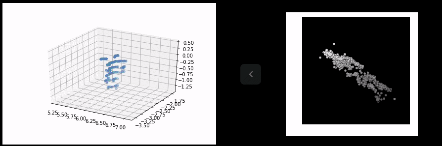

# PointGAN \(90%\)

> ubuntu 18, python3.6.7

## 1. 설치

```text
$ sudo apt-get install python3-opencv python3-tk
$ pip3 install http://download.pytorch.org/whl/cu80/torch-0.1.11.post5-cp27-none-linux_x86_64.whl 
$ pip3 install torchvision progressbar2


$ cd ~
$ git clone https://github.com/fxia22/pointGAN.git
$ cd pointGAN

$ bash build.sh #build C++ code for visualization
$ bash download.sh #download dataset
```

## 2. 모델 생성

```text
$ python3 show_gan.py --model gan/modelG_10.pth # choose your own model
```

> 필요시 주석 처리 `print('[%d: %d/%d] train lossD: %f lossG: %f' %(epoch, i, num_batch, lossD.data[0], lossG.data[0]))`

## 3. 데이터 생성

```text
python3 show_gan.py --model gan/modelG_3.pth
```

> 필요시 수정 `gen = PointGen(num_points = 2500)`

## 4. 사용자 학습 데이터 활용

1. synsetoffset2category.txt에 `폳더명, Label명 추가` eg. `7777`, `human`
2. `train_gan.py`의 `class_choice` 를 label명으로 수정 eg. `class_choice = ['human']`



* [pointGAN](https://github.com/fxia22/pointGAN)
* [ShapeNet 학습 데이터](https://github.com/hunjung-lim/awesome-vehicle-datasets/blob/master/Object/shpaenet/README.md)

